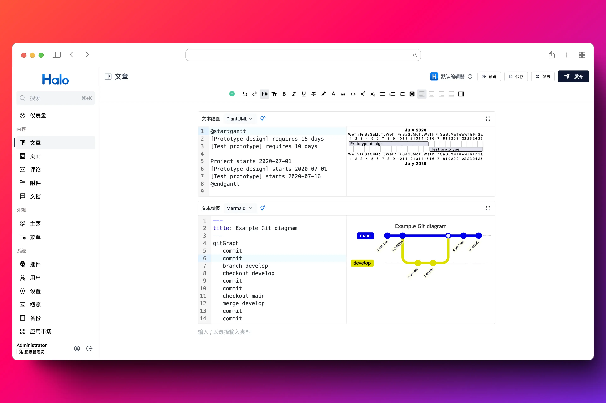

# 文本绘图

为 Halo 2 的默认编辑器和文章渲染提供文本绘图（Mermaid & PlantUML）支持。



## 使用方式

1. 下载，目前提供以下两个下载方式：
    - GitHub Releases：访问 [Releases](https://github.com/xinkeng0/plugin-text-diagram/releases) 下载 Assets 中的 JAR 文件。
    - Halo 官方应用市场：<https://www.halo.run/store/apps/app-ahBRi>
2. 安装，插件安装和更新方式可参考：<https://docs.halo.run/user-guide/plugins>。

## 用法说明

### 默认编辑器

可以在指令菜单（/）中找到 **文本绘图** 菜单项，选择即可插入新的文本绘图块。

### 文章页渲染

此插件安装之后，支持渲染文本绘图。

配置项：
1. dark_class_selector

   CSS-Selector语法，用来查找可以表示当前用户是否是暗黑主题的Dom。
   
   默认值为：`html[class~=dark]`（官方theme-earth暗黑模式class），如需兼容其他主题，则设置为相应的Selector即可（CSS-Selector支持A或B，`,`分隔即可）
   
   example：`html[class~=dark],html[data-color-scheme=dark]`

3. mermaid_selector

   CSS-Selector语法，用来查找渲染的mermaid-Dom。

   默认值为：`text-diagram[data-type="mermaid"]`（本插件扩展默认编辑器生成的行内公式Dom），如需兼容其他编辑器，则设置为相应的Selector即可（CSS-Selector支持或，`,`分隔即可）

   example：`.class1,.class2`

## 开发环境

```bash
git clone git@github.com:halo-sigs/plugin-text-diagram.git

# 或者当你 fork 之后

git clone git@github.com:{your_github_id}/plugin-text-diagram.git
```

```bash
cd path/to/plugin-text-diagram
```

```bash
# macOS / Linux
./gradlew pnpmInstall

# Windows
./gradlew.bat pnpmInstall
```

```bash
# macOS / Linux
./gradlew build

# Windows
./gradlew.bat build
```

修改 Halo 配置文件：

```yaml
halo:
  plugin:
    runtime-mode: development
    classes-directories:
      - "build/classes"
      - "build/resources"
    lib-directories:
      - "libs"
    fixedPluginPath:
      - "/path/to/plugin-text-diagram"
```
